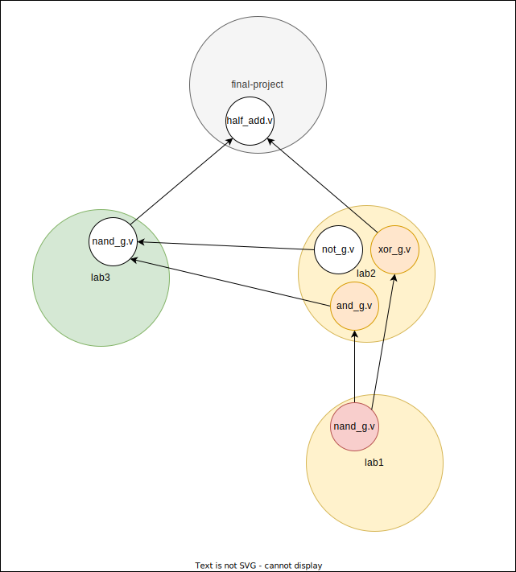

# Dynamic Symbol Transformation

This technique is related to _name mangling_ in programming languages. _Name mangling_ is a technique used to solve problems regarding the need to resolve unique names for programming entities. You can learn more about name mangling [here](https://en.wikipedia.org/wiki/Name_mangling).

## Problem

Before we begin, it is important to understand the problem we are trying to solve. An issue inherent to VHDL, Verilog, SystemVerilog, and many other languages is _namespace pollution_, which is when a large number of programming language variables/identifiers/units/classes are defined at the global level. To learn more about namespace pollution, [here](https://stackoverflow.com/questions/8862665/what-does-it-mean-global-namespace-would-be-polluted/13352212) is a StackOverflow post that explains it in relation to Javascript.

Namespace pollution can lead to _namespace clashes_. As you define more primary design units at the same scope, you are more likely to have two things that accidently have the same name. This is at the core the problem we are going to solve, because HDL compilers and synthesizers are not built to gracefully handle clashes and will error out when a primary design unit at the same scope has multiple definitions.

In VHDL/Verilog, a common example of a namespace clash is when different files define an entity/module by the same name, which may have different behaviors. Namespace clashes may start to appear when a higher-level ip requires the same entity/module from an ip but as different versions throughout its dependency tree.

## Solution

We solve the namespace pollution problem with an algorithm called _dynamic symbol transformation_ (DST). The DST algorithm solves the namespace clashing problem by rewriting conflicts with a new unique identifier without losing information in the original identifier.

### Limitations

Orbit automatically handles resolving duplicate identifiers for primary design units due to two design contraints. The limitations are:
1. All primary design unit identifiers in the current ip must be unique within the scope of the ip.
2. All primary design units identifiers in the current ip must be unique within the scope of the ip's direct dependencies. An identifier can be duplicated for primary design units across indirect dependencies.


## Example

This section walks through a basic demonstration of the DST algorithm. First, it defines some terminology, and then walks through the algorithm's functionality.

### Symbols

Within the context of VHDL, let's consider a _symbol_ to be the identifier of a _primary design unit_. A primary design unit is a VHDL construct that exists at the global namespace. There are four primary design units:
- entity
- package
- configuration
- context

> __Note:__ VHDL does support the concept of _libraries_, which can add 1 level of nested scope to a primary design unit, but this implementation only pushes the namespace clashing problem back 1 level.

Within the context of Verilog/SystemVerilog, let's consider a _symbol_ to be the identifier of a _design element_. A design element is a Verilog/SystemVerilog construct that exists at the global namespace. For Verilog, there is only two design elements (module and primitive), but for SystemVerilog, there are seven design elements:
- module
- program
- interface
- checker
- package
- primitive
- configuration

In the following code, the symbol `nand_g` corresponds to a module.

Filename: lab1/nand_g.v
``` verilog
module nand_g (
  input wire a, 
  input wire b,
  output wire c
);
```

Remember that this identifier could appear again at the same namespace level (since its global across all source code files), even if it has a different interface/implementation. 

Now imagine you are integrating HDL code from various existing ips. As you instantiate modules within larger modules, you realize there exists another module named `nand_g` in the hierarchy, but this one has a different behavior and port interface than the previously defined `nand_g` circuit from the "lab1/" directory.

Filename: lab3/nand_g.v
``` verilog
module nand_g (
  input wire[3:0] x,
  input wire[3:0] y,
  output wire[3:0] z
);
```

Since the current ip requires both code segments, then traditionally your EDA tool would complain to you and be unable to resolve which `nand_g` to be used where. It then falls on the developer to rename one of the modules where it is defined and everywhere it is referenced, which introduces additional overhead in time and possibilities for errors. This problem is solved with DST.

### Setup

Consider the following project-level ip dependency tree:


The gray node (`final-project`) is the local ip you are currently working within, the green nodes (`lab2`, `lab3`) are the direct dependencies to the local ip, and the blue node (`lab1`) is an indirect dependency to the local ip.

Within each project, there exists one or more HDL source code files describing design units. 

Imagine the `final-project` ip has a module called `half_add` which is the root of circuit hierarchy. From there, it reuses entities from the other ip.

Consider then HDL-level dependency tree:


Notice lab1 and lab3 both have the `nand_g` module, but their interfaces and functionality are different as previously mentioned. How can we allow both units in the hierarchy while resolving the namespace clash?

### Transformation

DST identifies namespace clashes within the current dependency graph and automatically resolve the conflicts to produce a clean unambiguous graph.



The yellow nodes (`lab2`, `lab1`) are the ips that had their source code modified due to DST. Since the modified contents of these ips no longer matches their original contents, the modifications are stored as separate entries in the catalog's cache apart from their original entries.

The red node (`nand_g.v`) is the HDL design element that must be dynamically renamed due to the namespace clash for `nand_g`. The identifier `nand_g` in lab1 was appended with the first 10 digits of the original ip's checksum (`fbe4720d0`). This transforms lab1's `nand_g` module into `nand_g_fbe4720d0`, which is unique and no longer clashes with `nand_g` in lab3.

> __Note:__ DST specifically chose to _not_ rename the `nand_g` from lab3. If had decided to rename the `nand_g` from lab3, the user would be burdened with tracking and maintaining the new renamed unique identifier in the local ip (final-project). Since DST never renames identifiers in direct dependencies, DST is always abstracted away from the user and has zero overhead. While direct dependencies may be modified due to neigboring an ip that undergoes DST, direct dependencies are never chosen for DST.

The orange nodes (`and_g.v`, `xor_g.v`) are the HDL design elements that reference/instantiate the design element that was marked for symbol transformation. Once the ip targeted for DST (lab1) resolves the namespace clash, we must update the references for this design element in all the upstream neighboring ips (lab2). Since their references are now broken due to `nand_g` being renamed to `nand_g_fbe4720d0`, the source code is analyzed and updated to fix the broken references of `nand_g` to `nand_g_fbe4720d0`.


The final unambiguous HDL-level dependency graph is the following:
```
half_add (final-project)
├─ nand_g (lab3)
│  ├─ not_g (lab2)
│  └─ and_g (lab2)*
|     └─ nand_g_fbe4720d0 (lab1)*
└─ xor_g (lab2)*
   └─ nand_g_fbe4720d0 (lab1)*
```

The `*` indicates the modules that had their source code modified to either rename the namespace collision or update its references to the new renamed identifier.

### Summary 

To recap, DST handled the namespace clash by _transforming_, or renaming, the module `nand_g` within lab1. The `nand_g` identifier was appended with the first 10 digits of the original lab1 ip's checksum (fbe4720d0) to make it `nand_g_fbe4720d0`. This transformation occurred at that ip's source code level (lab1), and modifications were made to the source code for all dependent neighbors of lab1, which was only lab2 in this example. The source code in lab2 had to be updated to rename the references that were originally `nand_g` to `nand_g_fbe4720d0`. Each ip that had source code modifications have their changes saved to their own entries in the catalog's cache, such that the original entries are still intact and available for future use.

## Emphasis

Dynamic symbol transformation lets Orbit avoid the major issues and frustrations of package management that stem from dependency incompatibility. As projects grow in complexity and the number of dependencies increases, Orbit can continue to allow users to integrate different verisons of the same package throughout the overall design while retaining dependency compatibility. Conflicts in incompatible versions are avoided within the dependency graph through DST. You can learn more about dependency incompatibility [here](https://en.wikipedia.org/wiki/Dependency_hell).

## Further Reading

- https://stephencoakley.com/2019/04/24/how-rust-solved-dependency-hell